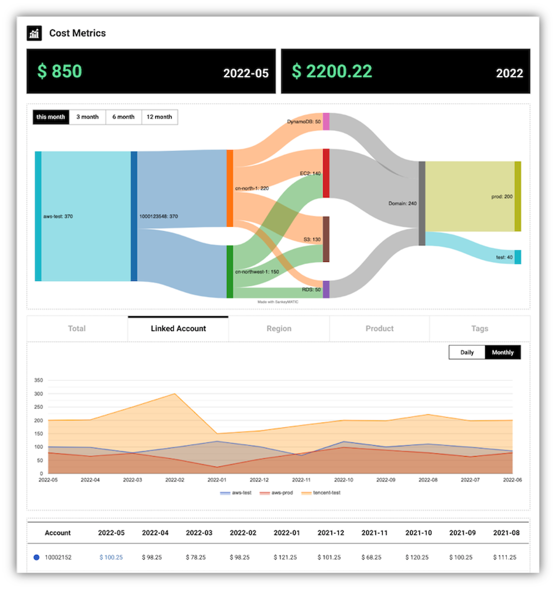

**MOF** is cloud native [FinOps](https://www.finops.org/introduction/what-is-finops/) platform for multi-cloud which aims to help user use cloud like a professional solution architect.

## Concept
**MOF** provides bellow core sets of features:

- [Cost analysis](#cost-analysis)
- [Cost forecasting](#cost-forecasting)
- [Cost optimization](#cost-optimization)
- [Cloud architecture management](#cloud-architecture-management)
- [Cloud offer management](#cloud-offer-management)
- [Cloud tag management](#cloud-tag-management)
- [Reserved instance management](#reserved-instance-management)

## Cost analysis
!!! tip "Commonly asked questions!"

    - What is cost of this month/year?
    - How about the trends of cost?
    - Which linked_account/region/service cost most?
    - Which team/feature cost most?
      - With Cloud Tags

**MOF** will collect and generate **Unit Cost Metrics** from cloud provider via API implemented by cloud providers. 

### LinkedAccount/Region/Service
High level metrics which defined and provided by cloud provider itself. 

### Tags
In order to answer question of **Which team/feature cost most?**, user needs to organize tags to resources.

It is always a best practices to tag resources by team/user/feature while provisioning.

### Screenshot
Comparing with old cost metrics which could be only seen as bar chart, MOF use sankey charts to help user validate unit cost at one glance.

!!! help "What is unit cost metrics?"

    _A common definition for unit economics is direct revenues and costs, associated with a particular business model, that are specifically expressed on a per-unit basis._
    [Measuring Unit Costs](https://www.finops.org/framework/capabilities/measure-unit-costs/) from FinOps foundation

## Cost forecasting

## Cost optimization

## Cloud architecture management

## Cloud offer management

## Cloud tag management

## Reserved instance management