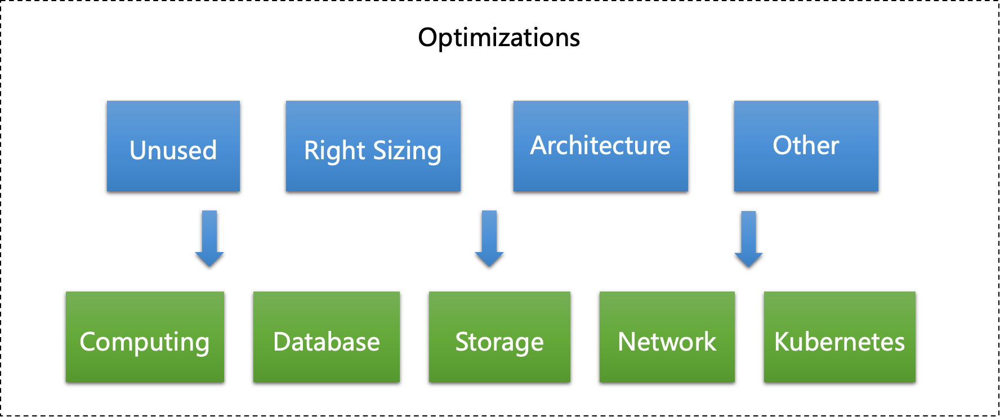
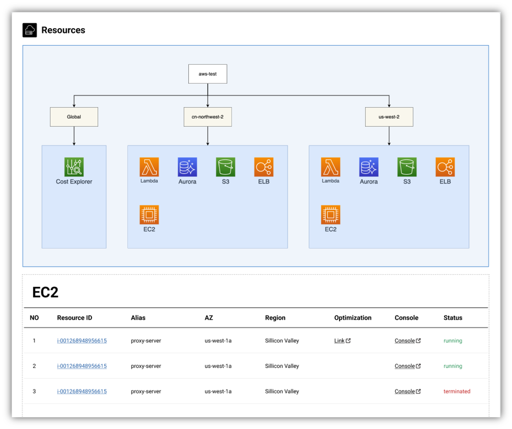
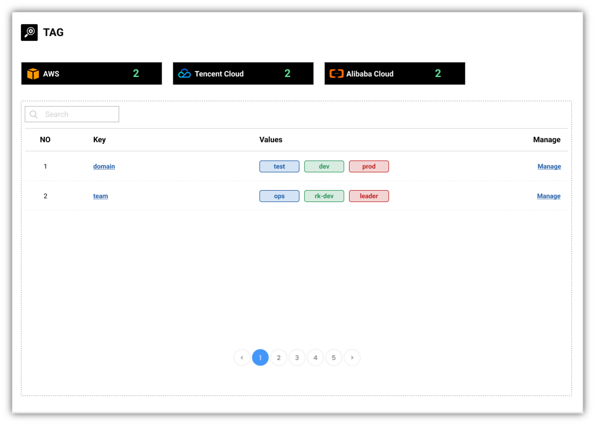
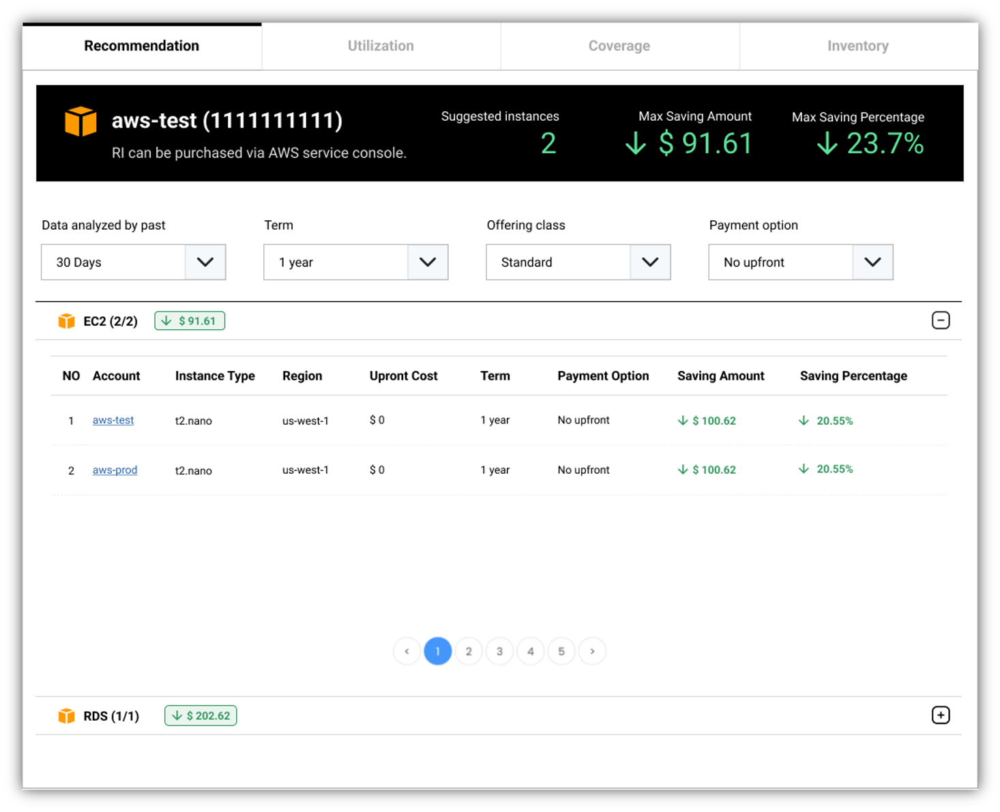

**MOF** is cloud native [FinOps](https://www.finops.org/introduction/what-is-finops/) platform for multi-cloud which aims to help user use cloud like a professional solution architect.

## Concept
**MOF** provides bellow core sets of features:

- [Cost analysis](#cost-analysis)
- [Cost forecasting](#cost-forecasting)
- [Cost optimization](#cost-optimization)
- [Cloud architecture management](#cloud-architecture-management)
- [Cloud offer management](#cloud-offer-management)
- [Cloud tag management](#cloud-tag-management)
- [Reserved instance management](#reserved-instance-management)

## Cost analysis
!!! tip "Commonly asked questions!"

    - What is cost of this month/year?
    - How about the trends of cost?
    - Which linked_account/region/service cost most?
    - Which team/feature cost most?
      - With Cloud Tags

**MOF** will collect and generate **Unit Cost Metrics** from cloud provider via API implemented by cloud providers. 

!!! help "What is unit cost metrics?"

    _A common definition for unit economics is direct revenues and costs, associated with a particular business model, that are specifically expressed on a per-unit basis._
    [Measuring Unit Costs](https://www.finops.org/framework/capabilities/measure-unit-costs/) from FinOps foundation

### LinkedAccount
High level metrics which defined and provided by cloud provider itself.

- [AWS](https://docs.aws.amazon.com/organizations/latest/userguide/orgs_manage_accounts.html)
- [Alibaba Cloud](https://www.alibabacloud.com/help/en/application-configuration-management/latest/sub-account-management)
- [Tencent Cloud](https://intl.cloud.tencent.com/document/product/598/40985?lang=en&pg=)

### Region
Region is concept defined in Cloud.

- [AWS](https://aws.amazon.com/about-aws/global-infrastructure/regions_az/)
- [Alibaba Cloud](https://www.alibabacloud.com/global-locations)
- [Tencent Cloud](https://intl.cloud.tencent.com/document/product/213/6091)

### Service
Cloud services.

- [AWS](https://aws.amazon.com/products/)
- [Alibaba Cloud](https://www.alibabacloud.com/product)
- [Tencent Cloud](https://intl.cloud.tencent.com/document/product/1043/38254)

### Tags
In order to answer question of **Which team/feature cost most?**, user needs to organize tags to resources.

It is always a best practices to tag resources by team/user/feature while provisioning.

- [AWS](https://docs.aws.amazon.com/general/latest/gr/aws_tagging.html)
- [Alibaba Cloud](https://www.alibabacloud.com/help/en/elastic-compute-service/latest/create-or-bind-a-tag)
- [Tencent Cloud](https://intl.cloud.tencent.com/document/product/651)

### Screenshot
Comparing with old cost metrics which could be only seen as bar chart, MOF use sankey charts to help user validate unit cost at one glance.

## Cost forecasting
Another important features in MOF is forecasting cost in clouds with multiple dimensions.

Factors affect cost forecasting:

- Resource consumption history
- Resource price
- Payment type
- Algorithm

!!! tip "Forecasting algorithm!"

    MOF is using facebook prophet to forecasting cost. However, it is rough forecasting modle.
    MOF will keeps on optimizing forecasting algorithms.

## Cost optimization
MOF will focus on optimization of Computing, Database, Storage, Network and Kubernetes in cloud services which is most commonly used services.

Every service have different optimization aspect. Bellow aspects are the sequence of MOF will implement. 

- Unused
- Right Sizing
- Architecture refactoring
- Other based on service features

## Cloud architecture management
It is always import for cloud users to have a high overview of resources using currently. MOF will collect most commonly used resources from Cloud and show it to users as tree chart view.

## Cloud offer management
Offer management will collect cloud service prices in order to provide optimizations.

## Cloud tag management
In order to let user tag resources in a convenient way, MOF also provides tag management interface to users

## Reserved instance management
Reserved Instances (RI) provide a significant discount compared to On-Demand pricing and provide a capacity reservation.

MOF provides management console with bellow features.

- Recommendation
- Utilization
- Coverage
- Inventory

## Spot instance management
TODO