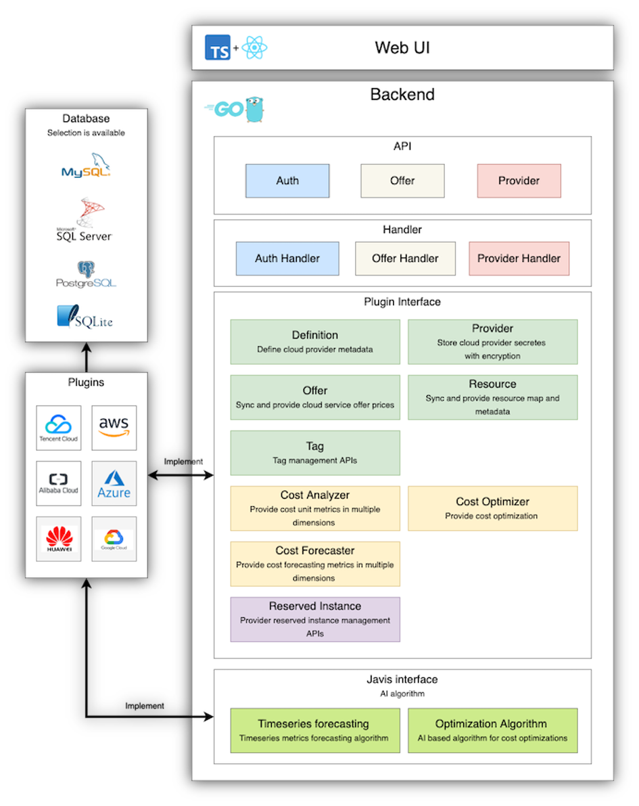

**MOF** support multi cloud provider with plugin style. User can implement their own cloud provider plugin.

## Architecture


**MOF** defines provider and jarvis interface to implement. **MOF** will keep defining builtin providers.

- AWS (Stable)
- Alibaba Cloud (Beta)
- Tencent Cloud (Beta)
- GCP (TODO)
- Azure (TODO)
- Huawei Cloud (TODO)

## Provider interface
### Definition
Defines cloud provider metadata like credentials etc.

| Function | Description                          |
|----------|--------------------------------------|
| GetDef() | Returns definition of cloud provider |

```go
type DefManager interface {
	GetDef() *Def
}

type Def struct {
	Name     string            `yaml:"name" json:"name"`
	Version  string            `yaml:"version" json:"version"`
	HomeUrl  map[string]string `yaml:"homeUrl" json:"homeUrl"`
	DocsUrl  map[string]string `yaml:"docsUrl" json:"docsUrl"`
	Location []struct {
		Name    string `yaml:"name" json:"name"`
		Default bool   `yaml:"default" json:"default"`
	} `yaml:"location" json:"location"`
	CredField []struct {
		Name     string `yaml:"name" json:"name"`
		Required bool   `yaml:"required" json:"required"`
		Example  string `yaml:"example" json:"example"`
		Type     string `yaml:"type" json:"type"`
	} `yaml:"credFields" json:"credFields"`
}
```

### Provider manager
Responsible for create and remove provider instance from user.

| Function           | Description                                               |
|--------------------|-----------------------------------------------------------|
| CreateProvider()   | Create a provider instance and store it into DB           |
| RemoveSensitive()  | Remove sensitive fields in provider while response to API |
| EncryptSensitive() | Encrypt provider credential                               |
| DecryptSensitive() | Decrypt provider credential                               |

```go
type ProvManager interface {
	CreateProvider(meta *ReqMeta, name, location string, credentials map[string]string) (*Provider, error)

	RemoveSensitive(instance *Provider)

	EncryptSensitive(meta *ReqMeta, instance *Provider) error

	DecryptSensitive(meta *ReqMeta, instance *Provider) error
}

type Provider struct {
	ModelBase
	Id                 int64             `yaml:"id" json:"id" gorm:"primaryKey" example:"1"`
	UserId             string            `yaml:"userId" json:"userId" gorm:"index" example:"xxx"`
	Version            string            `yaml:"version" json:"version" gorm:"index" example:"v1"`
	Name               string            `yaml:"name" json:"name" gorm:"index" example:"aws-test"`
	Type               string            `yaml:"type" json:"type" gorm:"index" example:"AWS"`
	Location           string            `yaml:"location" json:"location" example:"global"`
	Credentials        map[string]string `yaml:"credentials" json:"credentials" gorm:"-"`
	Extensions         map[string]string `yaml:"extensions" json:"extensions" gorm:"-"`
	CredentialsFlatten string            `yaml:"-" json:"-"`
	ExtensionsFlatten  string            `yaml:"-" json:"-"`
}
```

### Offer manager
Responsible for syncing and retrieving cloud service offers.

| Function             | Description               |
|----------------------|---------------------------|
| ListOffers()         | List cloud service offers |
| SyncOffers()         | Sync cloud service offers |
| OfferLastUpdatedAt() | As name described         |

```go
type OfferManager interface {
	ListOffers(meta *ReqMeta, req *ListOffersReq) (*ListOffersResp, error)

	SyncOffers(meta *ReqMeta, req *SyncOffersReq) (*SyncOffersResp, error)

	OfferLastUpdatedAt() (time.Time, error)
}
```

### Resource manager
Responsible for collecting and aggregating cloud resource and usage metrics.

| Function             | Description                            |
|----------------------|----------------------------------------|
| ResourceSummary()    | Summarise cloud resources              |
| RefreshResource()    | Sync cloud resource list               |
| GetArch()            | Generate tree chart based on resources |
| ListResources()      | List resources                         |
| GetResourceDetail()  | Get resource detail                    |
| GetResourceMetrics() | Get resource usage metrics             |

```go
type ResourceManager interface {
	ResourceSummary(meta *ReqMeta, instances ...*Provider) (*ResourceSummaryResp, error)

	RefreshResource(meta *ReqMeta, instance *Provider) (*RefreshResourceResp, error)

	GetArch(meta *ReqMeta, instance *Provider) (*GetArchResp, error)

	ListResources(meta *ReqMeta, instance *Provider) (*ListResourcesResp, error)

	GetResourceDetail(meta *ReqMeta, instance *Provider) (*GetResourceDetailResp, error)

	GetResourceMetrics(meta *ReqMeta, instance *Provider) (*GetResourceMetricsResp, error)
}
```

### Tag manager
Responsible for tagging and untagging cloud resources.

| Function                 | Description              |
|--------------------------|--------------------------|
| ListTags()               | List tags                |
| ListResourcesByTag()     | List resources with tags |
| TagResource()            | Tag resource             |
| UntagResource()          | Untag resource           |
| ListTaggableDimensions() | List tag dimensions      |

```go
type TagManager interface {
	ListTags(meta *ReqMeta, instance *Provider) (*ListTagsResp, error)

	ListResourcesByTag(meta *ReqMeta, instance *Provider) (*ListResourcesByTagResp, error)

	TagResource(meta *ReqMeta, instance *Provider, req *TagResourceReq) (*TagResourceResp, error)

	UntagResource(meta *ReqMeta, instance *Provider, req *UntagResourceReq) (*UntagResourceResp, error)

	ListTaggableDimensions(meta *ReqMeta, instance *Provider) (*ListTaggableDimensionsResp, error)
}
```

### Cost analyzer
Responsible for collecting and aggregating cloud cost.

| Function      | Description                            |
|---------------|----------------------------------------|
| CostSummary() | Get cost summary of multiple providers |
| GetCost()     | Get cost detail metrics                |

```go
type Analyser interface {
	CostSummary(meta *ReqMeta, instances ...*Provider) (*CostSummaryResp, error)

	GetCost(meta *ReqMeta, instance *Provider) (*GetCostResp, error)
}
```

### Cost optimizer
Responsible for generating optimization.

| Function               | Description              |
|------------------------|--------------------------|
| OptimizationSummary()  | Get optimization summary |
| ListOptimizations()    | List optimizations       |
| RefreshOptimizations() | Refresh optimization     |

```go
type Optimizer interface {
	OptimizationSummary(meta *ReqMeta, instances ...*Provider) (*OptimizeSummaryResp, error)

	ListOptimizations(meta *ReqMeta, instances ...*Provider) (*ListOptimizationsResp, error)

	RefreshOptimizations(meta *ReqMeta, instances ...*Provider) (*RefreshOptimizationsResp, error)
}
```

### Cost forecaster
Responsible for forecasting cloud cost.

| Function                | Description               |
|-------------------------|---------------------------|
| ForecastSummary()       | Get cost forecast summary |
| GetForecast()           | Get cost forecast metrics |
| GetForecastDimensions() | Get forecast dimensions   |

```go
type Forecaster interface {
	ForecastSummary(meta *ReqMeta, instances ...*Provider) (*ForecastSummaryResp, error)

	GetForecast(meta *ReqMeta, instance *Provider) (*GetForecastResp, error)

	GetForecastDimensions(meta *ReqMeta, instance *Provider) (*GetForecastDimensionsResp, error)
}
```

### RI manager
Responsible for managing reserved instances.

| Function               | Description                 |
|------------------------|-----------------------------|
| ListRiRecommendation() | List RI recommendations     |
| ListRi()               | List RI                     |
| ListRiUtil()           | List RI utilization metrics |
| ListRiCoverage()       | List RI coverage metrics    |
| ListRiServices()       | List RI resources           |

```go
type RiManager interface {
	ListRiRecommendation(meta *ReqMeta, instance *Provider) (*ListRiRecommendationResp, error)

	ListRi(meta *ReqMeta, instance *Provider) (*ListRiResp, error)

	ListRiUtil(meta *ReqMeta, instance *Provider) (*ListRiUtilResp, error)

	ListRiCoverage(meta *ReqMeta, instance *Provider) (*ListRiCoverageResp, error)

	ListRiServices(meta *ReqMeta) *ListRiServicesResp
}
```

## Jarvis interface
Please refer to [Jarvis](jarvis)
