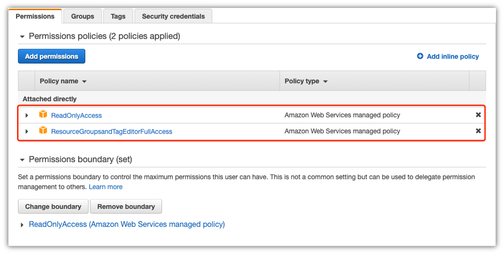
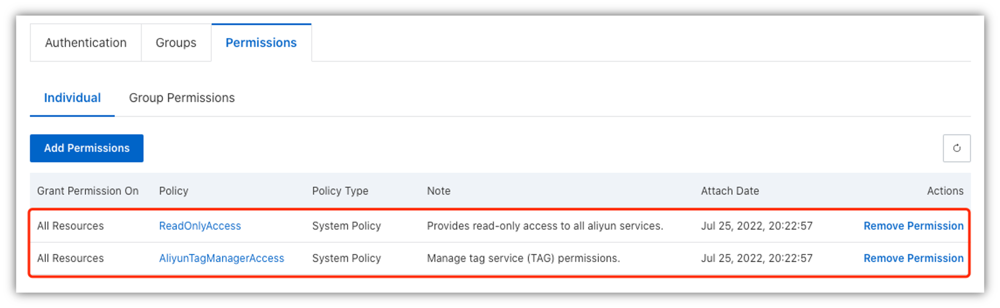
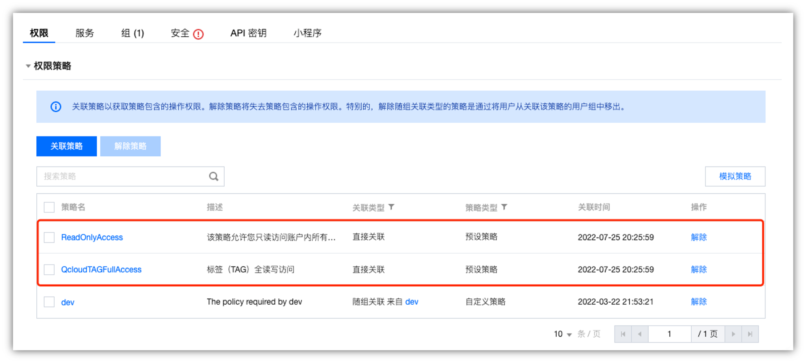

In this section, we will learn how to add cloud provider into **MOF**

## Set permission
**MOF** needs to have read permissions for all services and read/write permission for tagging.

> The reason why **MOF** needs to have read permissions for all services is because **MOF** will keep tracking optimizations for more services.

### AWS
In AWS console, please select bellow policies to a single user.

- ReadOnlyAccess
- ResourceGroupsandTagEditorFullAccess

### Alibaba Cloud
In Alibaba Cloud console, please select bellow policies to a single user.

- ReadOnlyAccess
- AliyunTagManagerAccess

### Tencent Cloud
In Tencent Cloud console, please select bellow policies to a single user.

- ReadOnlyAccess
- QcloudTAGFullAccess

## Add provider
After grant permissions to user, the next step add user credentials in **MOF**.

> TODO: Add steps