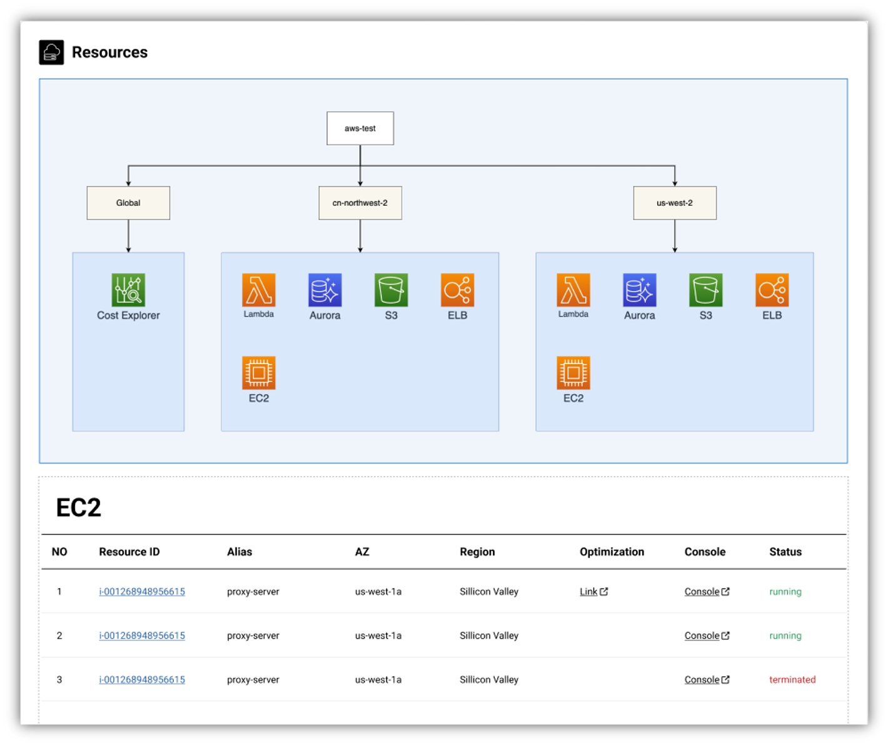

How to visualise your cloud cost in **MOF**?

## Select provider

## Visualise cost
**MOF** provides two types of unit cost metrics.

- **Sankey chart**: Visualise cloud cost at on glance
- **Metrics with data tables**: Visualise cloud cost detail

## Get resource map
**MOF** provides **tree chart** to visualise user resources at one glance.

## Get resource detail
**MOF** provides a table with detail link to see resource details.

