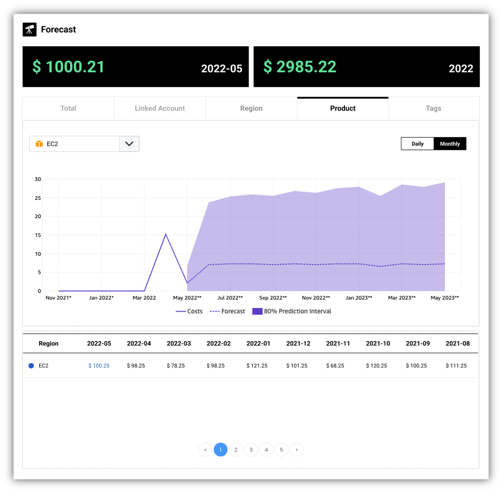

How to forecast your cloud cost with **MOF**?

## Select provider

## Visualise forecast
Forecasting of cost metrics can be multidimensional.

!!! tip "Smarter algorithm is on the way!"

    Since the historical data and forecasting model is the most important two parts while do the forecasting, **MOF** team will bring a smarter solution for this soon!

### AWS
**MOF** is pulling forecasting metrics from AWS currently. In future release, **MOF** will implement its own algorithm.

### Alibaba Cloud
**MOF** is using [prophet](https://github.com/facebook/prophet) to forecast cost metrics based on historical data.

### Tencent Cloud
**MOF** is using [prophet](https://github.com/facebook/prophet) to forecast cost metrics based on historical data.
