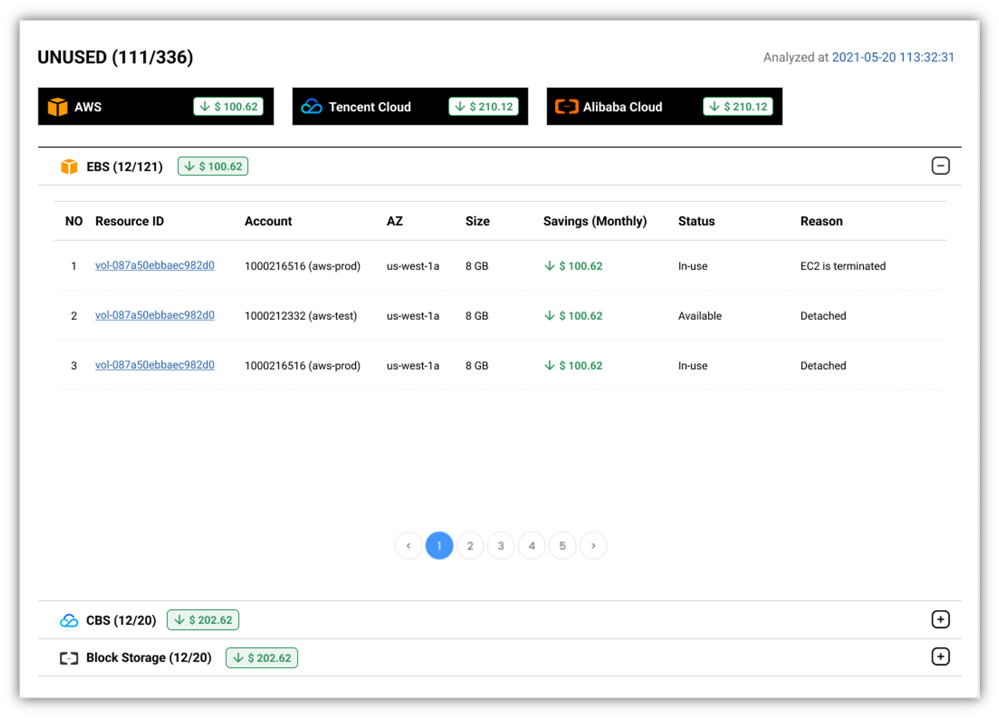
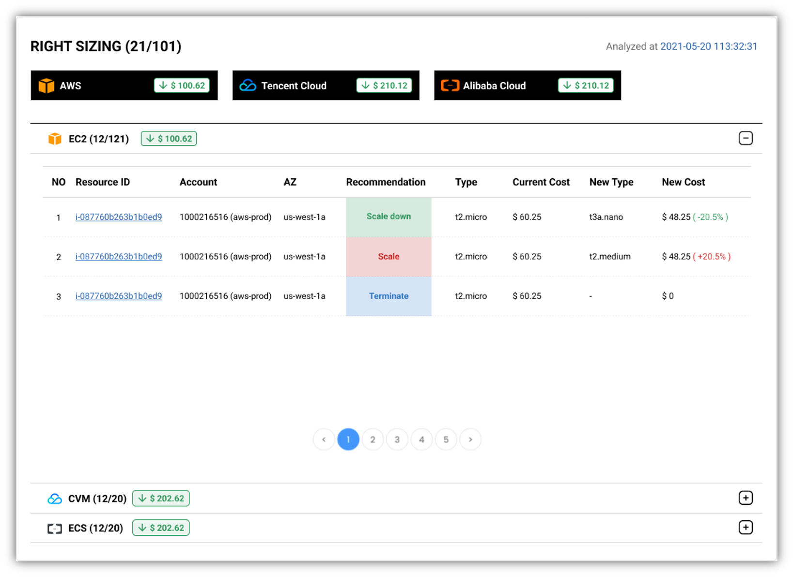

How to check optimizations from cloud with **MOF**?

!!! tip "More services and smarter algorithm is on the way!"

    **MOF** will support more services and smarter algorithms for optimizations!

## Refresh optimization
By default, **MOF** will automatically refresh optimizations with background thread periodically.

There is also a **Refresh** button provided by **MOF**

## Unused
**MOF** will collect unused resources and calculate the saving amount for user.

## Right sizing
**MOF** will collect resources needs to be right sized and calculate the saving amount for user.

