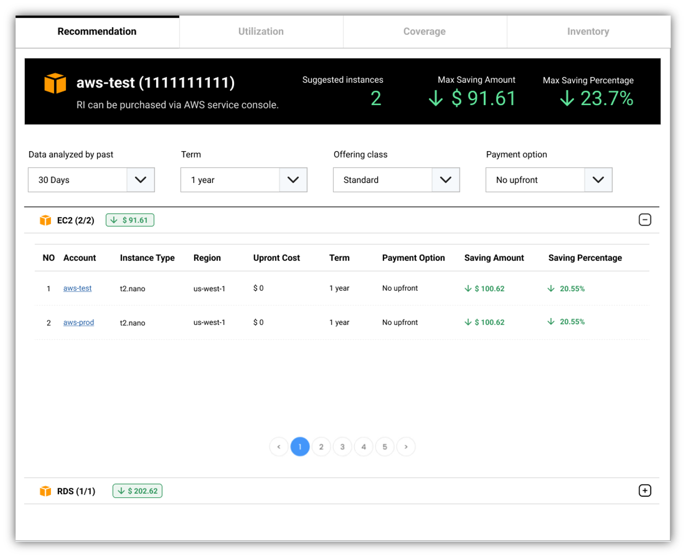
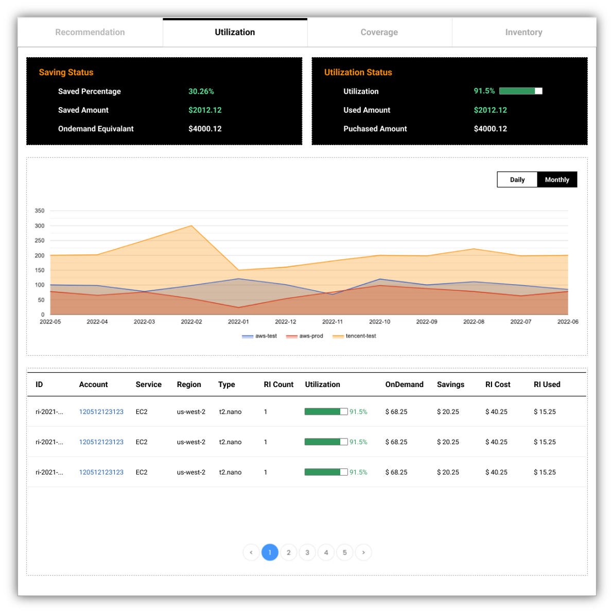
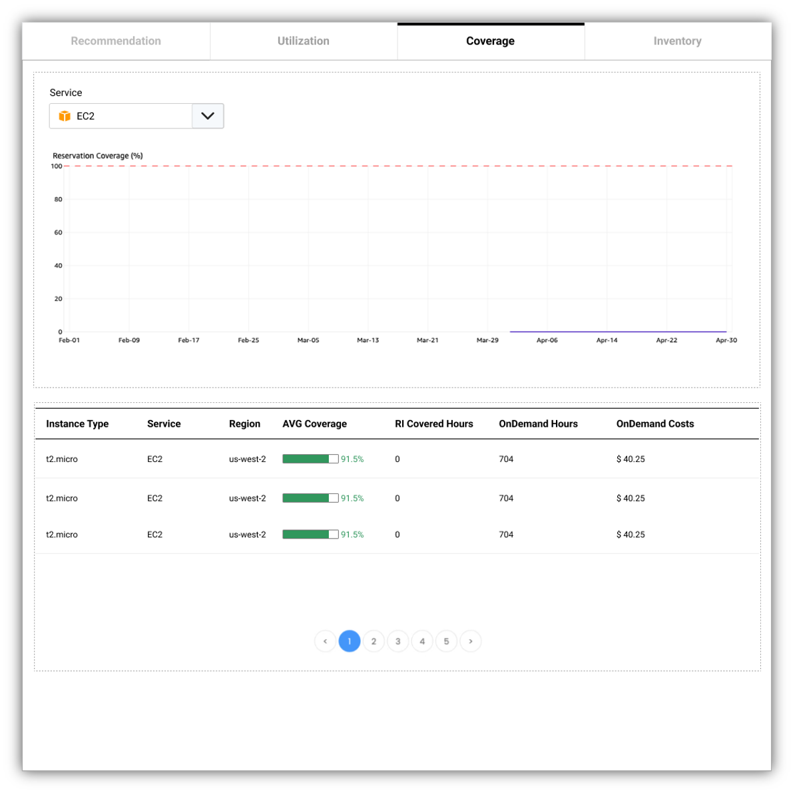
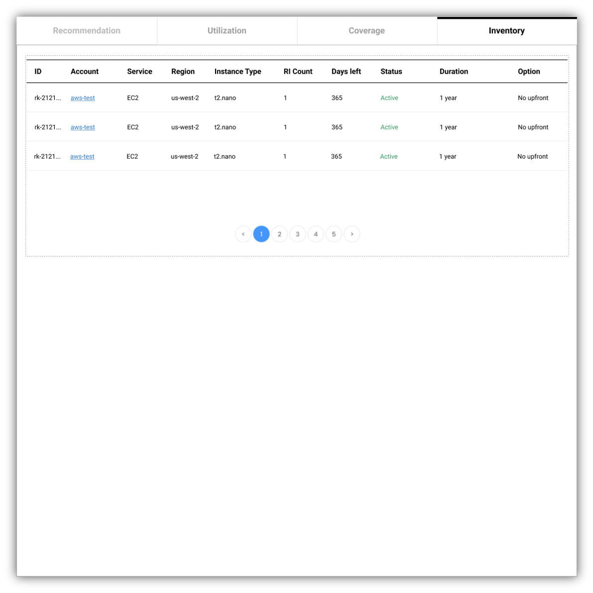

How to manage RI with **MOF**?

!!! tip "smarter algorithm of recommendation is on the way!"

    **MOF** will support smarter algorithms for RI recommendation!

## Recommendation
Cloud providers offers multiple RI offers with different conditions. User could choose the ones best fit for them.

## Utilization
User can also check RI utilization metrics from **MOF**. Saved amount of money can also be calculated based on utilization.

## Coverage
The coverage represent how many RI instances is covering user's current instance usage. The higher coverage represent the higher saving ratio.

## Inventory
List all RI purchased by user.

