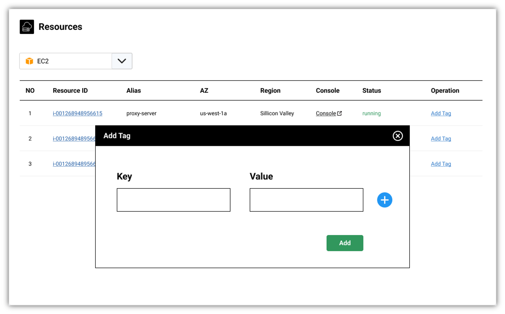
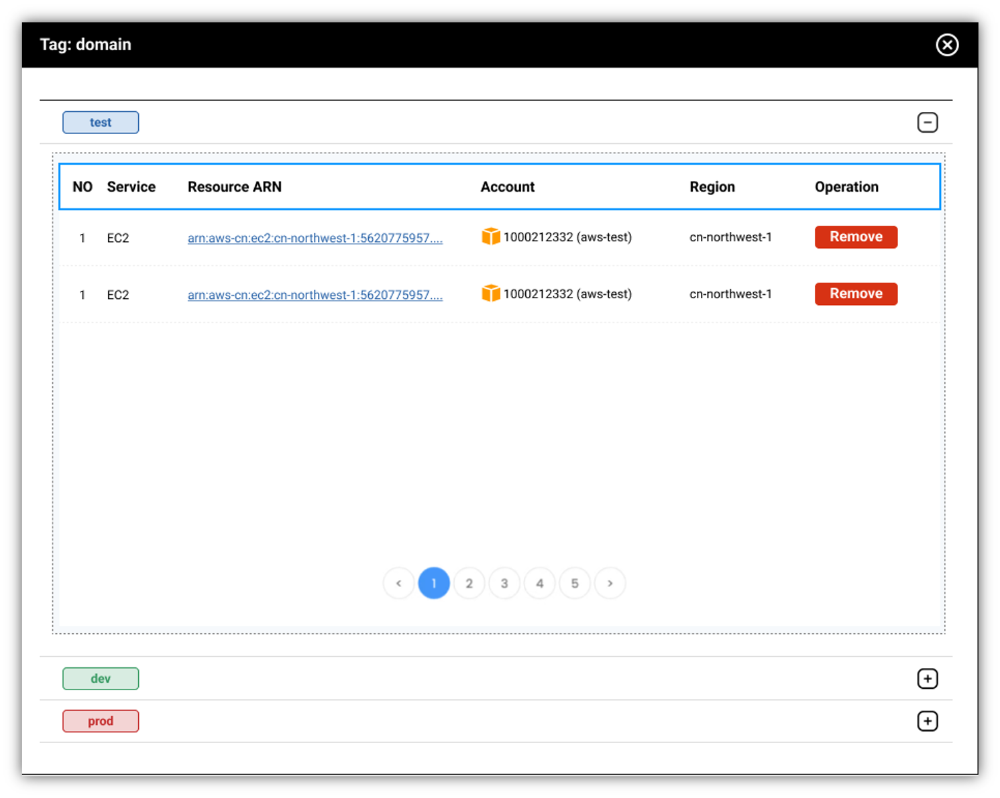

A convenient way to tag resources in cloud with **MOF**

## Why tagging?
As we mentioned earlier, unit cost metrics needs to be specified with tags like your-team, your-feature.

So **MOF** brings the ability of tagging/untagging resources.

## Tag resource

## Untag resource
